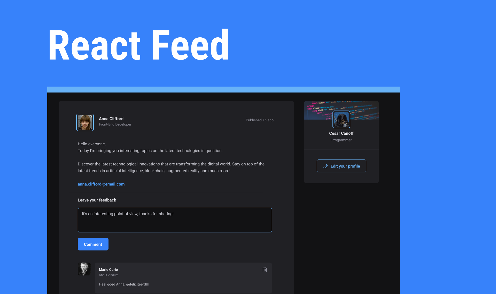

 <br />
  <br />
<p>
  Welcome to <b>React Feed</b>, the platform where you can discover, share, and interact with interesting content. Explore a dynamic feed, like, comment, and share your favorite posts, and engage in meaningful discussions. Join us and be part of a vibrant community!
</p>

<h3>📚 Technologies</h3>

  
  
  
  
  
  

  1. Clone the repository:
  Open your terminal (Command Prompt for Windows) and execute the following command to clone the React Feed repository:
  ```bash
  git clone git@github.com:CesarCanoff/react-feed.git
  ```

  2. Navigate to the app directory:
  Change to the Do It directory that you just cloned:
  ```bash
  git clone git@github.com:CesarCanoff/react-feed.git
  ```

  3. Install dependencies:
  Use npm to install all the app's dependencies. This may take some time depending on the project's size:
  ```bash
  npm install
  ```
  4. Run web app:
  After the dependencies are successfully installed, you can start the app. Run the following command:
  ```bash
  npm run dev
  ```